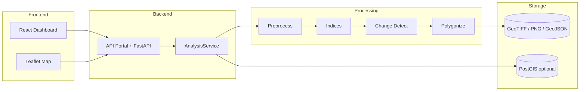

<div align="center">

# GeoAI Urban Intelligence

### Satellite change detection for Muscat & Oman — research prototype

**Detect · Quantify · Map** urban growth and vegetation change from multi-temporal Sentinel-2 imagery.

[](backend/requirements.txt)
[](backend/app/main.py)
[](frontend/package.json)
[](docker-compose.yml)
[](LICENSE)

[Dashboard](#-quick-start) · [API Portal](#-interfaces--docs) · [HTML Docs](docs/site/index.html) · [Architecture](docs/architecture.md) · [Pipeline](docs/pipeline.md)

</div>

---

> **فارسی (خلاصه):** پروتوتایپ پژوهشی GeoAI برای تشخیص و کمی‌سازی تغییرات شهری با تصاویر ماهواره‌ای چندزمانه روی **مسقط و عمان**. داشبورد تعاملی، API زیبا، پایپ‌لاین ماژولار رستر، و مستندات چندصفحه‌ای.

> ⚠️ **Disclaimer:** Research prototype only. Validate outputs with expert review / field data before any operational or planning decision.

---

## Why this exists

Cities grow faster than field surveys can track. Multi-spectral satellite time series make urban expansion, vegetation loss, and land-cover shifts **observable, measurable, and mappable**.

This project answers:

> *How can we detect and quantify urban change from satellite imagery — and present it as usable intelligence?*

| Observe | Measure | Interpret |
|:---:|:---:|:---:|
| Compare T1 vs T2 imagery | Area, %, NDVI Δ, NDBI Δ | Hotspots for planning review |

---

## Highlights

| Capability | What you get |
|---|---|
| **Multi-AOI study areas** | Oman national + Muscat, Sohar, Salalah, Nizwa, Duqm, Sur |
| **Spectral intelligence** | NDVI, NDBI, SAVI, NDWI + extended metrics |
| **Change detection** | Baseline spectral thresholding + optional **CVA** |
| **Spatial products** | Change polygons (GeoJSON), scores, area stats |
| **Map overlays** | Browser-ready PNG layers (RGB, NDVI diff, change mask) |
| **Interactive dashboard** | KPI cards, trend/pie charts, layer toggles, AOI draw |
| **API portal** | Branded FastAPI home + themed Swagger / ReDoc |
| **Offline-friendly** | Synthetic samples + file-store fallback (no PostGIS required) |

---

## Architecture



**Flow:** `React/Leaflet → FastAPI → modular pipeline → rasters + vectors (+ PostGIS)`

---

## Tech stack

| Layer | Tools |
|---|---|
| Backend | Python, FastAPI, uvicorn, Pydantic Settings |
| Raster / GIS | rasterio, NumPy, SciPy, scikit-image |
| Vector | GeoPandas, Shapely, PyProj |
| Database | PostgreSQL 16 + PostGIS 3.4 *(optional)* |
| Frontend | React 18, TypeScript, Vite, Leaflet |
| Data access | Planetary Computer STAC, pystac-client, stackstac |
| Ops | Docker Compose, pytest |

---

## Interfaces & docs

| Surface | URL / path | Purpose |
|---|---|---|
| **Dashboard** | `http://127.0.0.1:5173` | Run analysis, explore map & charts |
| **API Portal** | `http://127.0.0.1:8000/` | Live health, endpoint shortcuts |
| **Swagger** | `http://127.0.0.1:8000/docs` | Try-it-out OpenAPI (GeoAI theme) |
| **ReDoc** | `http://127.0.0.1:8000/redoc` | Readable API reference |
| **HTML docs** | [`docs/site/`](docs/site/index.html) | Urban science + technical story (FA) |
| **Deep dives** | [`docs/architecture.md`](docs/architecture.md), [`docs/pipeline.md`](docs/pipeline.md) | Diagrams & step detail |

Serve the HTML docs locally:

```bash
python -m http.server 5500 --directory docs/site
# → http://127.0.0.1:5500
```

---

## Quick start

### Prerequisites

- Python **3.12+**
- Node.js **20+**
- PostGIS *(optional)* — file-based run store works without it
- Docker *(optional)* — for one-command stack

### 1) Backend

```bash
cd backend
python -m venv .venv

# Windows
.venv\Scripts\activate

# macOS / Linux
# source .venv/bin/activate

pip install -r requirements.txt
python ../scripts/generate_test_rasters.py
uvicorn app.main:app --host 127.0.0.1 --port 8000
```

### 2) Frontend

```bash
cd frontend
npm install
npm run dev -- --host 127.0.0.1 --port 5173
```

Open **http://127.0.0.1:5173** → choose a study area → **Run Analysis**.

### 3) Docker (full stack)

```bash
docker compose up --build
```

| Service | URL |
|---|---|
| Frontend | http://localhost:5173 |
| API portal | http://localhost:8000/ |
| PostGIS | localhost:5432 |

Copy `.env.example` → `.env` for local overrides.

---

## Dataset

**Primary AOI:** Muscat, Oman · WGS84 ≈ `[58.35, 23.50, 58.65, 23.65]`  
**Source:** [Microsoft Planetary Computer](https://planetarycomputer.microsoft.com/api/stac/v1) · `sentinel-2-l2a`

| Property | Value |
|---|---|
| Sensor | Sentinel-2A/2B (Copernicus / ESA) |
| Bands | B02, B03, B04, B08, B11 |
| CRS | EPSG:32640 (UTM 40N) |
| Composites | Dry-season median (Oct → Feb), e.g. 2020 vs 2025 |

**Reproducibility paths**

1. `scripts/download_sentinel2.py` / `scripts/download_oman.py` — STAC downloads  
2. `data/samples/` — coherent synthetic GeoTIFFs for CI & offline demos  
3. `data/metadata/dataset_metadata.json` — provenance record  

---

## Processing pipeline

```text
GeoTIFF T1/T2
    → validate → CRS / reproject → align (X/Y) → AOI crop
    → NoData mask → NDVI / NDBI / …
    → change detection (baseline | CVA)
    → polygonize → stats + GeoJSON
    → PNG overlays for Leaflet
```

Details: [`docs/pipeline.md`](docs/pipeline.md)

---

## Methods (short)

### Indices

```text
NDVI = (NIR − Red) / (NIR + Red)
NDBI = (SWIR − NIR) / (SWIR + NIR)
```

Also computed: **SAVI**, **NDWI**, plus distribution stats (mean, percentiles, fractions).

### Change detection

| Method | Idea | When |
|---|---|---|
| **Baseline** *(default)* | Spectral / NDVI intensity + σ threshold | Fast, explainable demos |
| **CVA** | Mahalanobis distance in feature space (χ²) | Richer multi-band change |

Built-up change is reported as a **relative NDBI shift** (proxy, not a full LULC classifier).

---

## API cheatsheet

| Method | Endpoint | Description |
|---|---|---|
| `GET` | `/api/health` | Service + DB status |
| `GET` | `/api/study-areas` | AOIs + available years |
| `POST` | `/api/analyze` | Full pipeline (samples or uploads) |
| `GET` | `/api/changes?run_id=` | Change GeoJSON |
| `GET` | `/api/statistics?run_id=` | Run statistics |
| `GET` | `/api/ndvi?run_id=` | NDVI summary |
| `GET` | `/api/rasters/{run_id}/{file}` | GeoTIFF / PNG download |

```bash
curl -X POST "http://127.0.0.1:8000/api/analyze" \
  -F "use_samples=true" \
  -F "method=baseline" \
  -F "study_area_id=muscat" \
  -F "year_t1=2020" \
  -F "year_t2=2025"
```

```json
{
  "run_id": "uuid",
  "study_area_km2": 524.3,
  "changed_area_km2": 18.7,
  "change_percentage": 3.57,
  "vegetation_change_percentage": -12.4,
  "built_up_change_percentage": 8.2,
  "num_change_regions": 7
}
```

Metrics are **computed from rasters** — not hard-coded placeholders.

---

## CLI & tests

```bash
# CLI analysis
python scripts/run_analysis_cli.py \
  --t1 data/samples/sample_t1.tif \
  --t2 data/samples/sample_t2.tif \
  --method baseline

# Real Sentinel-2 (example)
python scripts/download_sentinel2.py --year 2020 --output data/raw/muscat_2020.tif
python scripts/download_sentinel2.py --year 2025 --output data/raw/muscat_2025.tif

# Tests
cd backend && pytest tests -v
```

---

## Repository layout

```text
├── backend/                 # FastAPI + GIS pipeline + API portal UI
│   └── app/web/             # Portal HTML + Swagger theme
├── frontend/                # React + Leaflet intelligence dashboard
├── data/
│   ├── samples/             # Synthetic GeoTIFFs for offline / CI
│   ├── raw/                 # Downloaded composites (gitignored)
│   ├── processed/           # Per-run outputs (gitignored)
│   └── metadata/            # Dataset provenance
├── scripts/                 # Download, samples, CLI
├── docs/
│   ├── site/                # Multi-page HTML documentation (FA)
│   ├── architecture.md
│   └── pipeline.md
├── docker/                  # PostGIS init
├── notebooks/               # Exploration
├── docker-compose.yml
└── README.md
```

---

## Limitations

- Research prototype — **not** ground-truth validated  
- Cloud / phenology / viewing geometry can create false positives/negatives  
- NDBI is a **spectral proxy**, not formal urban classification  
- Classical methods only (no deep-learning CD yet)  
- Sentinel-2 **10 m** limits sub-pixel detail  
- Sample rasters are synthetic stand-ins until STAC downloads are used  

---

## Roadmap

- [ ] SCL cloud masking in download pipeline  
- [ ] Supervised LULC (e.g. Random Forest)  
- [ ] Deep learning change models (FC-Siam-diff / BIT)  
- [ ] Multi-date time series (>2 epochs)  
- [ ] COG / tile server for map performance  
- [ ] Accuracy assessment against reference data  
- [ ] GitHub Actions CI  

---

## License

MIT — see [`LICENSE`](LICENSE).

---

<div align="center">

**Built as a GeoAI R&amp;D prototype for urban remote sensing over Oman.**

*Observe the city from orbit. Measure what changed. Map what matters.*

</div>
