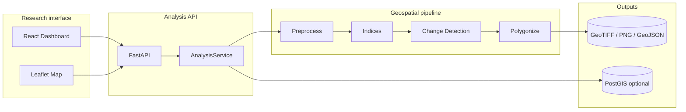

<div align="center">

# GeoAI Urban Intelligence

### A geospatial research prototype for satellite-based urban change analysis

**Detect · Quantify · Map** urban growth, built-up change, and vegetation dynamics from multi-temporal Sentinel-2 imagery.

[](backend/requirements.txt)
[](backend/app/main.py)
[](frontend/package.json)
[](docker-compose.yml)
[](LICENSE)

[Research relevance](#research-relevance) · [Methods](#methods) · [Architecture](#architecture) · [Quick start](#quick-start) · [Documentation](docs/)

</div>

---

## Research focus

GeoAI Urban Intelligence was developed as a **research-oriented prototype** for exploring how satellite-derived spatial indicators can support the monitoring and interpretation of urban transformation.

The current case study focuses on **Muscat and selected urban areas in Oman**, using multi-temporal Sentinel-2 imagery to measure changes in vegetation, built-up intensity, and spatial patterns of urban growth.

The project is designed to connect **urban planning questions** with reproducible geospatial workflows rather than to provide an operational planning or regulatory system.

> **Research question:** How can multi-temporal satellite imagery be transformed into interpretable spatial evidence for reviewing urban change?

### Research relevance

This prototype demonstrates a workflow that can support research on:

- **Urban growth and land transformation**
- **Spatial monitoring for urban and regional planning**
- **Vegetation loss and environmental change in expanding cities**
- **Comparative analysis of development patterns across multiple urban areas**
- **Evidence-informed planning through accessible spatial indicators and maps**
- **Reproducible geospatial analysis for policy and research applications**

The emphasis is on turning remote-sensing outputs into information that can be reviewed by planners and researchers: change areas, spatial hotspots, summary statistics, and interactive map layers.

> **Disclaimer:** This is a research prototype. Outputs should be validated with expert review, reference data, or field evidence before use in operational planning or decision-making.

---

## What the prototype does

| Capability | Output |
|---|---|
| **Multi-AOI study areas** | Oman national view + Muscat, Sohar, Salalah, Nizwa, Duqm, Sur |
| **Spectral indicators** | NDVI, NDBI, SAVI, NDWI and supporting statistics |
| **Change detection** | Explainable baseline thresholding + optional Change Vector Analysis |
| **Spatial outputs** | Change polygons (GeoJSON), scores and area statistics |
| **Map products** | RGB, NDVI-difference and change-mask overlays |
| **Interactive exploration** | React/Leaflet dashboard with KPI cards, charts and layer controls |
| **Reproducible API** | FastAPI endpoints for analysis, outputs and statistics |
| **Offline research mode** | Synthetic sample data and file-based storage without mandatory PostGIS |

---

## Methods

### Data

**Primary case study:** Muscat, Oman  
**Source:** Microsoft Planetary Computer STAC · Sentinel-2 L2A  
**Bands:** B02, B03, B04, B08, B11  
**Working CRS:** EPSG:32640 (UTM Zone 40N)

The workflow can compare seasonal composites from two time periods, for example 2020 and 2025.

### Spectral indices

```text
NDVI = (NIR − Red) / (NIR + Red)
NDBI = (SWIR − NIR) / (SWIR + NIR)
```

Additional indicators include **SAVI** and **NDWI**, together with distribution statistics such as means, percentiles and area fractions.

### Change detection

| Method | Purpose |
|---|---|
| **Baseline** | Fast and interpretable spectral / NDVI intensity change detection |
| **CVA** | Multi-feature Change Vector Analysis using Mahalanobis distance |

Built-up change is treated as a **relative NDBI-based proxy**, not as a formal supervised land-use/land-cover classification.

### Processing pipeline

```text
Sentinel-2 / GeoTIFF T1 + T2
    → validate and reproject
    → align and crop to AOI
    → mask NoData
    → compute spectral indices
    → detect change
    → polygonize significant regions
    → calculate statistics
    → publish GeoJSON + raster overlays
    → explore in interactive dashboard
```

More detail: [`docs/pipeline.md`](docs/pipeline.md)

---

## Architecture



---

## Research & technical skills demonstrated

This project brings together:

- **Urban and spatial analysis**
- **GIS and remote sensing**
- **Sentinel-2 time-series handling**
- **Raster processing:** rasterio, NumPy, SciPy, scikit-image
- **Vector analysis:** GeoPandas, Shapely, PyProj
- **Spatial databases:** PostgreSQL / PostGIS
- **Interactive mapping:** Leaflet
- **Research software development:** Python, FastAPI, React, TypeScript
- **Reproducibility and deployment:** Docker Compose, pytest, structured metadata

---

## Quick start

### Requirements

- Python **3.12+**
- Node.js **20+**
- PostGIS *(optional)*
- Docker *(optional)*

### Backend

```bash
cd backend
python -m venv .venv

# Windows
.venv\Scripts\activate

# macOS / Linux
# source .venv/bin/activate

pip install -r requirements.txt
python ../scripts/generate_test_rasters.py
uvicorn app.main:app --host 127.0.0.1 --port 8000
```

### Frontend

```bash
cd frontend
npm install
npm run dev -- --host 127.0.0.1 --port 5173
```

Open `http://127.0.0.1:5173`, select a study area and run an analysis.

### Docker

```bash
docker compose up --build
```

---

## Interfaces

| Surface | Local path |
|---|---|
| Dashboard | `http://127.0.0.1:5173` |
| API portal | `http://127.0.0.1:8000/` |
| Swagger | `http://127.0.0.1:8000/docs` |
| ReDoc | `http://127.0.0.1:8000/redoc` |
| HTML documentation | `docs/site/` |

---

## Reproducibility

1. `scripts/download_sentinel2.py` and `scripts/download_oman.py` retrieve imagery through STAC.
2. `data/samples/` contains synthetic GeoTIFFs for offline demonstrations and tests.
3. `data/metadata/dataset_metadata.json` records data provenance.
4. Analysis outputs are generated from rasters rather than hard-coded dashboard values.

Example CLI run:

```bash
python scripts/run_analysis_cli.py \
  --t1 data/samples/sample_t1.tif \
  --t2 data/samples/sample_t2.tif \
  --method baseline
```

---

## Limitations

- Not yet validated against comprehensive ground-truth data
- Cloud, phenology and viewing geometry may create false change signals
- NDBI is a spectral proxy rather than formal urban classification
- Current change methods are classical rather than deep-learning based
- Sentinel-2 spatial resolution limits sub-pixel interpretation
- Synthetic samples are used for offline demonstrations where real imagery is unavailable

These limitations are intentionally documented because the repository is presented as a **research prototype**, not as a production planning system.

---

## Roadmap

- [ ] Improve Sentinel-2 cloud masking
- [ ] Add supervised land-use / land-cover classification
- [ ] Add multi-date time-series analysis
- [ ] Evaluate deep-learning change-detection models
- [ ] Add reference-data accuracy assessment
- [ ] Improve scalable raster serving for larger study areas
- [ ] Expand comparative urban case studies

---

## Author

**Mahdi Sadeghiha**  
Urban Planning · International Relations · Geospatial Analysis  
GitHub: [@mahdisadeghiha](https://github.com/mahdisadeghiha)

---

## License

MIT — see [`LICENSE`](LICENSE).

<div align="center">

**GeoAI Urban Intelligence — research software for observing and interpreting urban change.**

</div>
