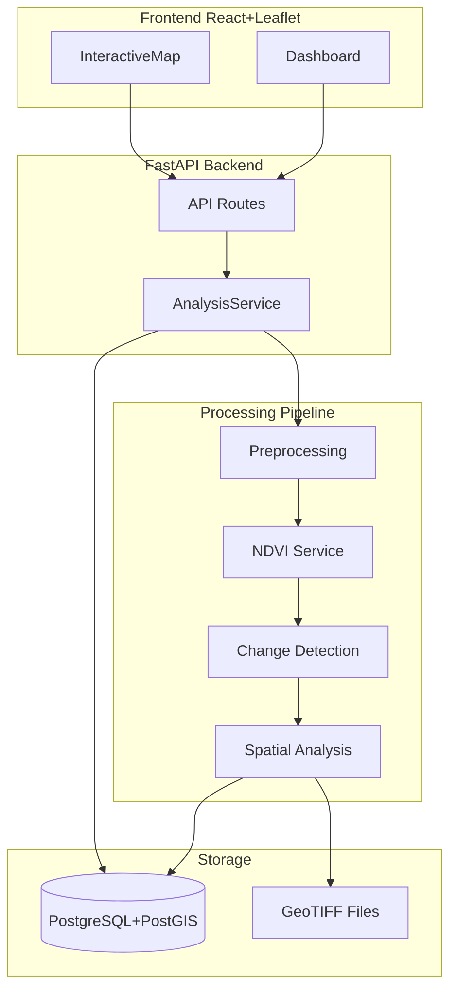

# Architecture

## Overview

GeoAI Urban Change Detection is a full-stack research prototype for detecting and quantifying urban land cover changes from multi-temporal satellite imagery.

## Components

### Backend (`backend/app/`)

| Module | Responsibility |
|---|---|
| `api/routes/` | REST endpoints: health, study-area, analyze, statistics, changes, ndvi, rasters |
| `core/config.py` | Environment-driven settings (bbox, CRS, thresholds, paths) |
| `core/database.py` | SQLAlchemy engine, PostGIS session, table initialization |
| `services/preprocessing/` | 8-step raster preparation pipeline |
| `services/ndvi/` | NDVI computation and vegetation change metrics |
| `services/change_detection/` | Baseline spectral diff + CVA advanced method |
| `services/spatial_analysis/` | Connected components, polygonization, GeoJSON export |
| `services/analysis_service.py` | Pipeline orchestration and persistence |
| `models/` | PostGIS ORM: StudyArea, AnalysisRun, ChangeRegion |
| `utils/run_store.py` | File-based fallback when PostGIS is unavailable |

### Frontend (`frontend/src/`)

| Module | Responsibility |
|---|---|
| `pages/Dashboard.tsx` | Main UI: study area, run analysis, stats, map |
| `map/MapView.tsx` | Leaflet map with ImageOverlay and GeoJSON layers |
| `components/` | StatsPanel, LayerControl |
| `services/api.ts` | Backend API client |

### Data (`data/`)

| Path | Purpose |
|---|---|
| `raw/` | Downloaded Sentinel-2 composites (gitignored) |
| `processed/` | Analysis outputs per run UUID (gitignored) |
| `samples/` | Synthetic test GeoTIFFs for CI and offline dev |
| `metadata/dataset_metadata.json` | Dataset provenance and reproducibility info |

## Deployment

Docker Compose runs three services:

- **db** — PostGIS 16
- **backend** — FastAPI on port 8000
- **frontend** — Nginx serving React on port 5173

## Design Principles

1. **No hard-coded statistics** — all metrics computed from raster data
2. **Modular pipeline** — each processing step is independently testable
3. **Graceful degradation** — file-based storage when PostGIS is unavailable
4. **Reproducibility** — STAC download script + metadata tracking
