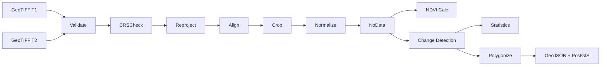

# Data Processing Pipeline

## Flow



## Step-by-Step

### 1. Validation
- Verify GeoTIFF exists, has CRS, transform, and minimum band count
- Location: `services/preprocessing/validate.py`

### 2. CRS Check
- Compare CRS of both images against target CRS (EPSG:32640)
- Location: `services/preprocessing/crs.py`

### 3. Reprojection
- Warp rasters to common CRS if needed (bilinear resampling)
- Location: `services/preprocessing/reproject.py`

### 4. Alignment & Cropping
- Snap both rasters to common grid at finest resolution
- Crop to intersection extent
- Location: `services/preprocessing/align.py`

### 5. Normalization
- Per-band percentile normalization (2nd–98th percentile)
- Location: `services/preprocessing/normalize.py`

### 6. NoData Handling
- Mask invalid pixels, produce valid pixel mask
- Location: `services/preprocessing/nodata.py`

### 7. NDVI Analysis
```
NDVI = (NIR - Red) / (NIR + Red)
NDVI_diff = NDVI_t2 - NDVI_t1
Vegetation Change % = relative change in mean NDVI
```

### 8. Change Detection

**Baseline method:**
- Spectral difference: |NIR_t2 - NIR_t1| + |Red_t2 - Red_t1|
- NDVI difference threshold (mean + σ × std)
- Binary change mask + intensity map

**Built-up proxy (NDBI):**
```
NDBI = (SWIR - NIR) / (SWIR + NIR)
Built-up Change % = relative change in mean NDBI
```

**Advanced method (CVA):**
- Change Vector Analysis in NIR–Red feature space
- Mahalanobis distance threshold (χ² at p=0.05)

### 9. Spatial Analysis
```
Change Mask → Connected Components → Polygonize → GeoJSON
```
Per-region attributes: area (km²), centroid, bounding box, change score

### 10. Statistics
All metrics computed from pixel counts and spectral means:
- Study area (km²)
- Changed area (km²)
- Change percentage
- Vegetation change %
- Built-up change %
- Number of change regions

## Output Artifacts

Each analysis run produces:
- `change_mask.tif` — binary change raster
- `change_intensity.tif` — change magnitude
- `ndvi_t1.tif`, `ndvi_t2.tif`, `ndvi_diff.tif`
- `rgb_t1.tif`, `rgb_t2.tif` — visual composites
- `change_regions.geojson` — vectorized change polygons
- `statistics.json` — computed metrics
